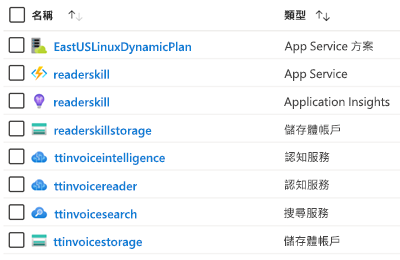

# AIML10：通过 AI 理解非结构化数据

## 讲座摘要

Tailwind Traders 拥有大量遗留数据，他们希望开发人员在其应用中使用这些数据。这些数据来自结构化和非结构化的各种来源，包括图像、表单、pdf 文件和其他形式。 在本讲座中，你将了解该团队如何使用认知搜索在短时间内厘清此数据，并取得令人惊叹的成功。 我们将讨论各种 AI 概念，如引入-扩充-探索模式、技能组、认知技能、自然语言处理、计算机视觉等。

## 目录
 

| 资源          | 链接                            |
|-------------------|----------------------------------|
| PowerPoint        | - [演示文稿](presentations.md) |
| 视频            | - [进行排练](https://www.youtube.com/watch?v=dm0wDTSso0E)  - [Microsoft Ignite 奥兰多录制内容](https://myignite.techcommunity.microsoft.com/sessions/82986?source=sessions) |
| 演示             | - [演示 1 - Azure 认知搜索](https://github.com/microsoft/ignite-learning-paths-training-aiml/blob/master/aiml10/demo1.md)  - [演示 2 - 表单识别器服务](https://github.com/microsoft/ignite-learning-paths-training-aiml/blob/master/aiml10/demo2.md)  - [演示 3 - 创建自定义发票读取者技能](https://github.com/microsoft/ignite-learning-paths-training-aiml/blob/master/aiml10/demo3.md) - [演示 4 - 组合](https://github.com/microsoft/ignite-learning-paths-training-aiml/blob/master/aiml10/demo4.md)  - [演示 5 - 知识存储](https://github.com/microsoft/ignite-learning-paths-training-aiml/blob/master/aiml10/demo5.md) | 

# 概述
在此解决方案中，我们制定了一个流程，通过该流程获取一组非结构化 pdf 发票并生成结构化的表格输出，只需将 Azure 认知搜索与自定义表单识别器技能配合使用即可。 

创建此解决方案时，会创建多项 Azure 资源（可以根据需要使用[此处的免费试用版](https://azure.microsoft.com/en-gb/free/?WT.mc_id=msignitethetour2019-github-aiml10)）。 下面的表列出了每项资源、其用途，以及完全实现解决方案所需的任何特殊说明（我使用了讲座中提供的名称，但这些名称需要根据你的特定解决方案重命名）：

## Azure 资源

| 名称                       | 类型                            | 用途                    |
| -------------------------- | ------------------------------- | ------------------------- |
| **ttcognitivesearch**     | 资源组                  | 将多种服务组合到一起   |
| **ttinvoicestorage**      | 存储帐户                 | 用于存储发票     |
| **ttinvoicesearch**       | 搜索服务                  | 特色服务           |
| **ttinvoiceintelligence** | 认知服务（全合一） | 在搜索服务中使用 |
| **ttinvoicereader**       | 表单识别器服务         | 此服务最终会出现在全合一服务中。 目前，它在访问受限的预览版中。 若要访问预览版，请填写并提交[表单识别器访问请求](https://aka.ms/FormRecognizerRequestAccess)表单。  |
| **readerskillstorage**   | 存储帐户              | 用于 Azure 函数的存储 |
| **readerskill**          | 函数应用                 | 认知技能应用 |
| **readerskill**          | App Insights                   | 向函数应用添加见解 |
| **EastUS2LinuxDynamicPlan** | 应用服务计划                   | 基于消耗情况的计划，用于运行函数应用 |

# 演示文稿

* [PowerPoint 下载](https://globaleventcdn.blob.core.windows.net/assets/aiml/aiml10/zh-CN/aiml10.zh-CN.pptx)
* [Microsoft Ignite 奥兰多大会视频](https://myignite.techcommunity.microsoft.com/sessions/82986?source=sessions)

# 演示
此讲座包含 5 个演示（已列在下面）。 

- **演示 1**：[Azure 认知搜索](demo1.md)
- **演示 2**：[表单识别器服务](demo2.md) - 此演示要求访问表单识别器预览版。 若要访问预览版，请填写并提交[表单识别器访问请求](https://aka.ms/FormRecognizerRequestAccess)表单。
- **演示 3**：[创建自定义发票读取者技能](demo3.md)
- **演示 4**：[将所有内容整合在一起](demo4.md)
- **演示 5**：[知识存储](demo5.md)

# 清理说明

### 完全清理

* 进入 Azure 门户并删除创建的 **Azure 资源组**，这样就可以删除此项目的所有资源

# 相关资源和继续学习

**Microsoft Learn：**
* [Azure 搜索简介](https://docs.microsoft.com/en-us/learn/modules/intro-to-azure-search/?WT.mc_id=msignitethetour2019-github-aiml10)
* [Microsoft Azure 人工智能 (AI) 战略和解决方案](https://docs.microsoft.com/en-us/learn/modules/azure-artificial-intelligence/?WT.mc_id=msignitethetour2019-github-aiml10)

**Azure 文档**
* [什么是 Azure 搜索中的“认知搜索”？](https://docs.microsoft.com/en-us/azure/search/cognitive-search-concept-intro/?WT.mc_id=msignitethetour2019-github-aiml10)
* [什么是 Azure 搜索中的知识存储？](https://docs.microsoft.com/en-us/azure/search/knowledge-store-concept-intro)

# 反馈和建议

想要提供意见、反馈、建议？ 目前，针对内容更改/建议/反馈的最佳方法是在此 GitHub 存储库中创建新的 Issue。 若要获取有关如何创建 Issue 的所有详细信息，请参阅[贡献文档](../CONTRIBUTING.md)

## 成为训练有素的演示者

若要成为训练有素的演示者，请联系 [scalablecontent@microsoft.com](mailto:scalablecontent@microsoft.com)。 在电子邮件中，请提供：

- 完整的姓名
- 此演示文稿的代码：aiml10
- 演示视频（约 10 分钟长）（例如：未列出的 YouTube 视频）链接。 
  > 无需是此内容，重要的是展示演示者技能

导师会将有关此过程的信息反馈给你。

## 训练有素的演示者

感谢以下优秀参与者（[表情符号密钥](https://allcontributors.org/docs/en/emoji-key)）：

<!-- ALL-CONTRIBUTORS-LIST:START - Do not remove or modify this section -->
<!-- prettier-ignore -->

<table>
<tr>
    <td align="center"><a href="https://github.com/sethjuarez">
         
        <b>Seth Juarez</b></a> 
            <a href="Add link to powerpoint here" title="讲座">📢</a>
            <a href="Add link to pull request here" title="文档">📖</a> 
    </td>
</tr></table>

<!-- ALL-CONTRIBUTORS-LIST:END -->