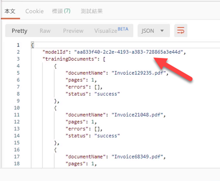

## <a name="demo-2---using-form-recognizer"></a>デモ 2 - Form Recognizer を使用する

[](https://globaleventcdn.blob.core.windows.net/assets/aiml/aiml10/videos/Demo2.mp4 "デモ 2")

## <a name="summary"></a>概要
この演習では、Form Recognizer サービスを使用する方法について学習します。 ストレージ アカウントが作成されていることを前提としています ([最初のデモ](demo1.md)を参照してください)。


## <a name="what-you-need"></a>必要なもの
- [請求書トレーニング セット](https://globaleventcdn.blob.core.windows.net/assets/aiml/aiml10/data/training.zip)

- アクセスが制限されたプレビューへのアクセス。 プレビューへのアクセスを取得するには、[Form Recognizer アクセス要求](https://aka.ms/FormRecognizerRequestAccess)フォームに記入して送信します。

- Form Recognizer サービス REST API に要求を送信するには、[Postman](https://www.getpostman.com/) を使用します。 詳細については、この[簡単な概要](postman.md)を参照してください。

- Postman Form Recognizer の要求の[コレクション](src/Collections/Form_Recognizer.postman_collection.json)。

## <a name="azure-resources"></a>Azure リソース
このデモで使用する唯一のリソースは、Form Recognizer サービスです。


| 名前                       | 種類                            | 目的                    |
| -------------------------- | ------------------------------- | ------------------------- |
| **ttinvoicereader**       | Form Recognizer サービス         | このサービスは、最終的にオールインワン サービスになります。 現時点では、アクセス制限付きのプレビューです。 プレビューへのアクセスを取得するには、[Form Recognizer アクセス要求](https://aka.ms/FormRecognizerRequestAccess)フォームに記入して送信します。  |


## <a name="what-to-do"></a>手順

主な手順が 3 つあります。
1. ストレージ アカウントにトレーニング データをアップロードする
2. Form Recognizer サービスを作成する
3. Form Recognizer サービスをトレーニングして使用する

### <a name="upload-training-data"></a>トレーニング データをアップロードする


1. 前のデモで作成したストレージ アカウントに、`train` という名前のコンテナーを作成します。

[](https://docs.microsoft.com/en-us/azure/storage/blobs/storage-quickstart-blobs-portal?WT.mc_id=msignitethetour2019-github-aiml10 "コンテナーを作成する")

2. [請求書トレーニング セット](https://globaleventcdn.blob.core.windows.net/assets/aiml/aiml10/data/training.zip)をダウンロードして解凍します。

3. 解凍された[請求書トレーニング セット](https://globaleventcdn.blob.core.windows.net/assets/aiml/aiml10/data/training.zip)を `train` コンテナーにアップロードします。 これは、[ポータル](https://docs.microsoft.com/en-us/azure/storage/blobs/storage-quickstart-blobs-portal?WT.mc_id=msignitethetour2019-github-aiml10#upload-a-block-blob)を使用して直接、または [Azure ストレージ エクスプローラー](https://docs.microsoft.com/en-us/azure/vs-azure-tools-storage-explorer-blobs?WT.mc_id=msignitethetour2019-github-aiml10)を使用して ([ビデオ](https://globaleventcdn.blob.core.windows.net/assets/aiml/aiml10/videos/Demo2.mp4 "デモ 1")を参照)、行うことができます。

### <a name="create-form-recognizer-service"></a>Form Recognizer サービスを作成する

これを行うには、Form Recognizer プレビューにアクセスできる必要があります。 プレビューへのアクセスを取得するには、[Form Recognizer アクセス要求](https://aka.ms/FormRecognizerRequestAccess)フォームに記入して送信します。 


[](https://docs.microsoft.com/en-us/azure/cognitive-services/form-recognizer/overview?WT.mc_id=msignitethetour2019-github-aiml10#request-access "Form Recognizer")

### <a name="train-the-form-recognizer-service"></a>Form Recognizer サービスをトレーニングする

このセクションでは、Postman を使用します。コレクションの読み込み、変数の処理、および事前要求スクリプトの設定について理解していることを前提としています。 これらの特定の操作を行う方法については、いくつかの[説明](postman.md)を用意してあります。

次の表では、演習のこのセクションで設定する変数を示します。

| 名前                       | 種類                            | 目的                    |
| -------------------------- | ------------------------------- | ------------------------- |
| `Ocp-Apim-Subscription-Key`       | 認可         | Form Recognizer サービスへのアクセスを取得するためのキー  |
| `endpoint`       | 変数         | Form Recognizer エンドポイントを指定します  |
| `modelId`       | 変数         | 現在の Form Recognizer モデル (ステップ 5 で設定されます)  |

1. [Form Recognizer コレクション](src/Collections/Form_Recognizer.postman_collection.json)を Postman に読み込みます。

2. `Ocp-Apim-Subscription-Key` Authorization ヘッダーおよび `endpoint` 変数を、Form Recognizer サービスに設定します (これらはポータルで確認できます)。

3. `TrainModel` 要求を開き、事前要求スクリプトを変更して、`storageAccount` 変数にはお使いのストレージ アカウントを設定し (ビデオでの変数は `ttinvoicestorage`)、`SASValue` には `train` コンテナーに対する適切なセキュリティで保護されたアクセス署名を設定します。 セキュリティで保護されたアクセス署名を取得する方法については、[簡単な説明](sas.md)を参照してください。

```javascript
pm.environment.set('storageAccount', '<YOUR STORAGE ACCOUNT>')
pm.environment.set('container', 'train')
pm.environment.set('SASValue', '<SAS>')
```

4. 要求で [送信] をクリックします。 応答は次のようになります。



5. コレクションの `modelId` 変数に、前に示した返された `modelId` を設定します。


### <a name="use-the-form-recognizer-service"></a>Form Recognizer サービスを使用する

1. `AnalyzeForm` 要求を開きます。 **[本文]** セクションで、[`Select Files`] ボタンをクリックして、以前にダウンロードした請求書を選択します。 要求を送信すると、次のような情報が表示されます。


# <a name="next-demo"></a>次のデモ
「[デモ 3 - カスタム請求書リーダー スキルを作成する](demo3.md)」に進み、Azure Functions を使用してカスタム請求書リーダー スキルを作成する方法を学習します
